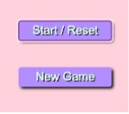
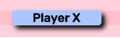

# Tic-Tac-Toe

This game was created for a project at General Assembly Sydney. It was made with JavaScript, HTML, CSS and jQuery.

My version of the game allows players to keep track of who's turn it is, the score and if it was a draw.

## Playing the game

The "Start/Reset" allows the players to choose between X and O and refresh the game with the button "Start/Reset".

The "New Game" button allows players to start a new game without refreshing the score on the scoreboard.

When it's a players turn their player button turns blue.  

## How the code works

Once a player clicks a button on the board it adds a class(X or O) to that particular block. It shows an image for X or O that it was hiding.

It then checks if that player won with another function containing conditions. If a player wins another class is added to change certain CSS styles.
This function also checks if there's a draw by counting how many moves have happened during the game.

The classes are removed once a player clicks on the 'Start/Reset' or 'New Game' buttons. And the game Counter is set to zero.

There is also a function to add points for either X or O on the scoreboard.

## links

I found the X and O letters on the site below.

[Free pngs](https://www.freepngs.com/letters-png)

[Tic-Tac-Toe game here](https://staceybros.github.io/tic-tac-toe/)
